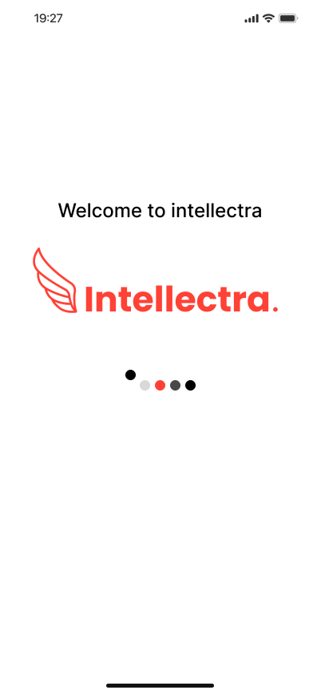
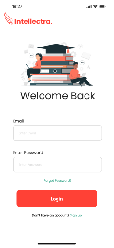
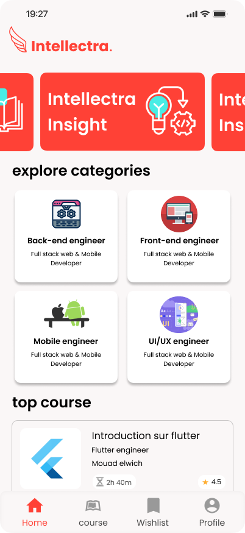
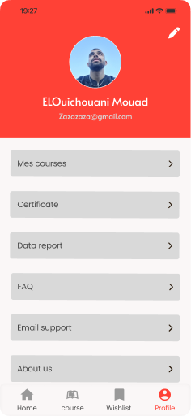

# Intellectra 🧠

An intelligent e-learning application built with Flutter, designed to provide a seamless and interactive educational experience. It integrates powerful modern features like generative AI, robust state management, and real-time backend services. 

## 📸 Screenshots

<p align="center">
  
  
  
  
  <br>
  
  
  
  
</p>

## ✨ Features

- **Secure Authentication:** Seamless sign-in and sign-up user flows powered by Appwrite.
- **Dynamic Dashboard:** Engaging UI with carousels, categorized learning content, and dynamic menus.
- **Advanced Search:** Robust filtering and search capabilities.
- **AI Integration:** Enhanced by `google_generative_ai` to provide smart, context-aware assistance.
- **Rich Media & Materials:** Full support for playing videos, handling image assets, and viewing PDFs.
- **Local Caching:** Offline capabilities and fast retrieval times using Hive and Shared Preferences.
- **Beautiful UI/UX:** Features animations using Lottie, customized typography via Google Fonts, and a responsive layout.

## 🛠️ Tech Stack & Dependencies

- **Framework:** Flutter SDK (^3.7.0)
- **Backend:** [Appwrite](https://appwrite.io/)
- **State Management:** Provider / GetX
- **Storage:** Hive, Shared Preferences
- **AI Tools:** Google Generative AI, Translator Plus
- **UI Libraries:** Carousel Slider, Animated Text Kit, Flutter Rating Bar, Lottie

## 🚀 Getting Started

This project is a starting point for a Flutter application. 

### Prerequisites

Ensure you have the following installed:
- [Flutter SDK](https://docs.flutter.dev/get-started/install) 
- Android Studio / Xcode (for emulation and building)
- Appwrite Instance (Local or Cloud)

### Installation

1. **Clone the repository**
   ```bash
   git clone https://github.com/your-username/intellectra.git
   cd intellectra
   ```

2. **Install dependencies**
   ```bash
   flutter pub get
   ```

3. **Run the app**
   ```bash
   flutter run
   ```

## 📚 Resources

A few resources to get you started if this is your first Flutter project:
- [Lab: Write your first Flutter app](https://docs.flutter.dev/get-started/codelab)
- [Cookbook: Useful Flutter samples](https://docs.flutter.dev/cookbook)

For help getting started with Flutter development, view the [online documentation](https://docs.flutter.dev/), which offers tutorials, samples, guidance on mobile development, and a full API reference.
